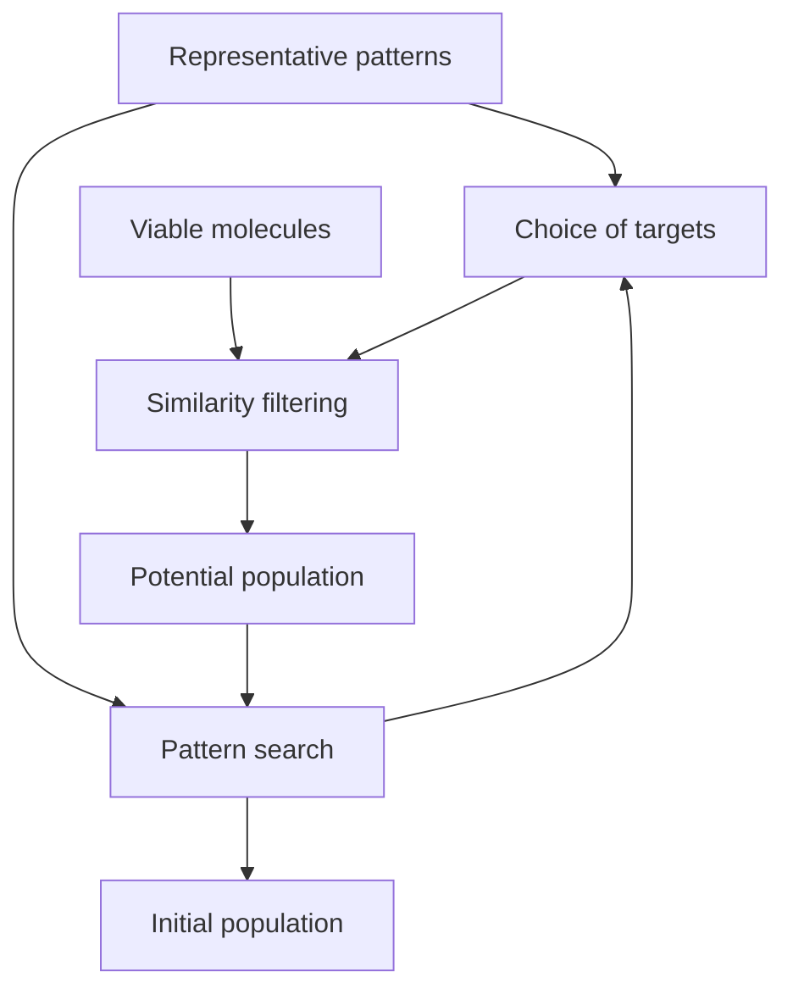

# 3D Benchmarks

This repository contains the work in progress of building a benchmark for **3D de novo molecular design** for organic and inorganic molecules.

## `2D_representations`

Folder containing scripts to investigate how to handle, retrieve, and compare SMILES of the CSD (Cambrdige Structural Database)

## `COD_similarity`

Folder containing script to test how to work, and perform HSR (Hypershape Recognition) similarity comparisons, with the COD (Crystallographic Open Database)

## `deprecated_code`

Folder to collect all scripts that have been deprecated

## `docking`

Folder containing scripts used to investigate the possibility of introducing a docking test in the benchmark using a host-guest compound with inorganic molecules (e.g., Ferrocene in Cucurbituril)

## `molecule_libraries`

Contains the work and the scripts used to define criteria and functions to filter a database (CSD and/or COD) to obtain "clean" molecules usable to genrate the targets and the initial populations of the benchmark's tests.

## `substructure_search`

Folder containing scripts to investigate the substructure capabilities of the CSD-Python-API

## `targets`

Contains the work and the scripts used to define a procedure to assert the quality of a target choice. 

### Current procedure

    
## `visualization`

Folder containing scripts for visualizing molecules and diagrams